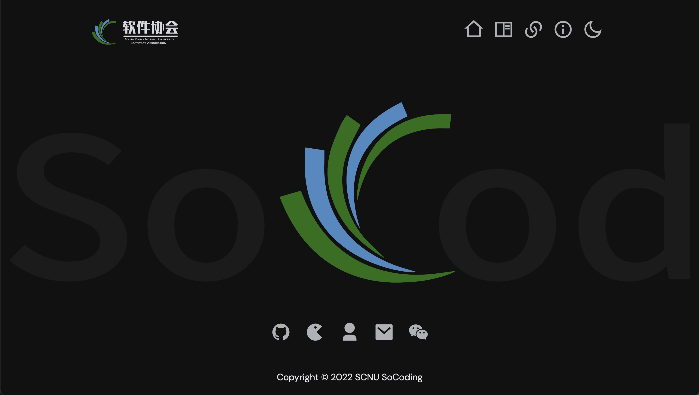
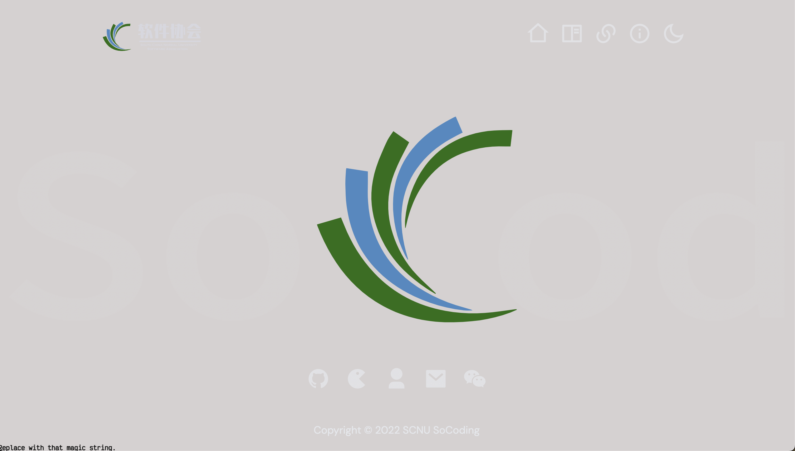
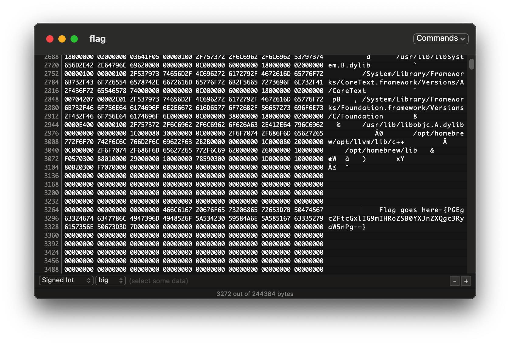
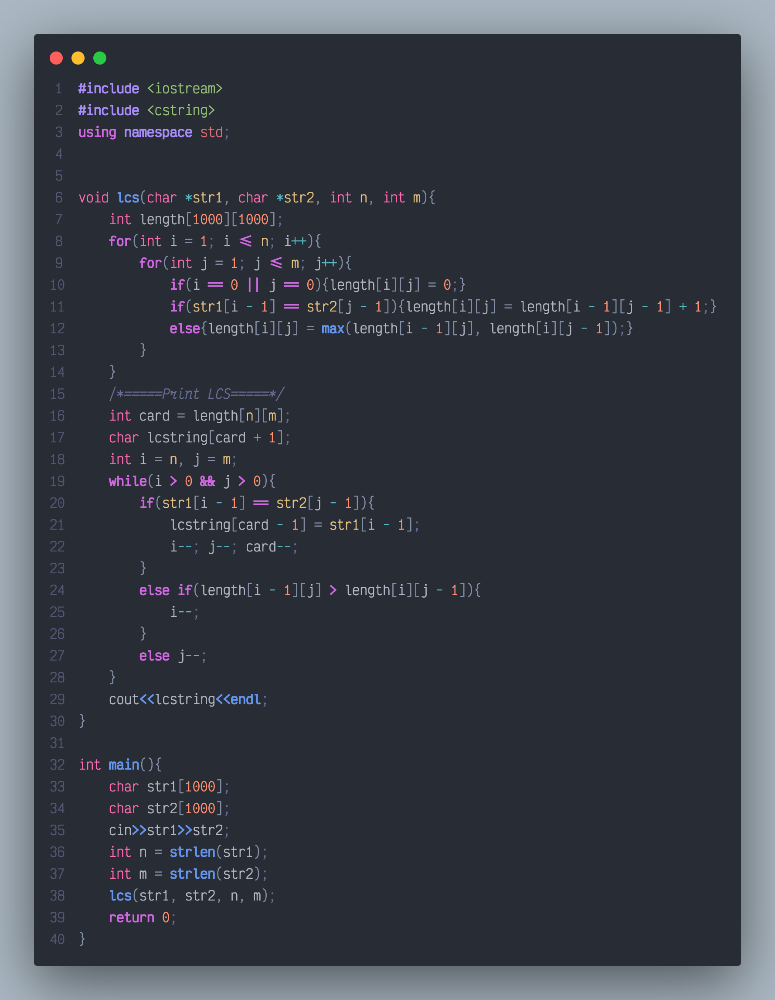

# Candidate questions of Socoding 1024 puzzle

## Q1: The Blend-in text "Blend-In"

简介：将字符串隐藏（背景和文字色调相同）在网页中，通过调整背景的颜色凸显文字，获得字符串。

## Examples: Socoding.cn




<center>Before</center>




<center>After</center>

下面给出CSS代码:

```css
html[lang]::before {
        content: "replace with that magic string";
        font: bold 10%/1 monospace; 
        position: fixed;
        left:100;
        bottom: 0;
        z-index: -1000;
        color: #111111 /* Match the color of the texts w/ background. */
    }
```

之所以在CSS上实现是避免在网页中无脑复制找到答案。

## 题面

> Socoding.cn(前面给出url，告诉答题者具体网页) background-color(这里给出提示，告诉回答者应该改背景色。)

我认为实际可在1024网页的某个位置藏字符串。这样不必再写一个页面，同时更immersive.


## Q2: Color In Hex "Color"

简介：放置多张排成一排的纯色图片(native实现亦可)，答题者通过拾色器得到对应的Hex Code， 按从左到右的顺序连接每个颜色对应的编号作为字符串。

## Example: France Flag

.svg)

<center>Contains 3 types of color. Subnautical, White, Blood Orange</center>

从左到右，三种颜色分别为 `#002654 #ffffff #ce1226`

则字符串应该为`002654ffffffce1226`

**注意**：

- 有必要规定十六进制颜色代码的格式：从最高位至最低位，分别为RGB. 即 按`#RRGGBB` 而非`#BBGGRR`

- 关于颜色空间，统一为sRGB(非Adobe RGB,P3)，避免拾色结果与标准答案不符。

## 题面

> Get all `{Color}`


## Q3: Picture-RAR Merge "Duality"

原理：由于rar文件的头部不需要在bytestream的开头，这使得我们能将图片文件的区块放在文件首部，而rar文件放在其后。图片查看器读入时会忽略后部rar文件bytestream，将其作为损坏区块；而rar程序读取时直接可读到其头部，确保了文件在两种情况下都能打开。

简介：仅给出一张图片，答题者应该想到改扩展名为.rar打开压缩文件得到字符串。

**注意** 为了增加难度，我们为压缩包里添加二进制文件，其中隐藏字符串，同时字符串使用base64加密，应通过hexdump(直接用text editor打开亦可)得到加密后的字符串并解密。


## Example:  Kotonoha Akane "琴葉　茜"


<center>Open the picture in rar format. 注：图片路径<code>./assets/Akane.png</code></center> 



<center>Find the flag.</center>

## 题面

> more than just an image.

附记：参考了去年的12题。


## Q4: DP Problem "Longest Common Subsequence"

### 原理：状态转移方程（递推公式）

$$
LCS(X_i\space,\space Y_j) = \begin{cases}Empty\space while\space i = 0 \space or\space j = 0\\
LCS(X_i,Y_j)=LCS(X_{i-1},Y_{j-1})+1\space while\space X_i = Y_j\\
max\{LCS(X_{i-1},Y_{j}),LCS(X_i,Y_{j-1})\}\space while\space X_i \neq Y_j\end{cases}
$$


简介：给出两个序列，求其公共最大子列。经典题不必多说。本题需要通过 数组 $LCS(X_i\space,\space Y_j)$ 重构出最长子序列。得到的序列即为所求字符串。

序列预先给出：长度为128+=flag

`flag=aecaeddebbdbaaaedececcedabccdcbacedaebdabcbcaaddbdabbeedaeacbdeddaabeaabdcabbabbacbbdddaecaeceeeeacedabceddedebbcabbbebbdbabddcc`

`flag=baebeebbbbabaedbecbcddcedacdbddaaecdddacdcabecbbeeadcbcecdcbbddabcecadbddedcbcdbbcbbbeceebaeedaeabeaedcacbddbcbdcaebcbeaadaeabca`

### 答案(One Possible Ver.)

以下答案由我给出，复杂度为$O(nm)$，Auxiliary Space $O(nm)$，没有进行滚动数组优化。



所求字符串为 `flag=aeeebbbaaedecccedacdbdaedaccabbbeeacbeddabeabdcbbbcbbeceeeeaeabeedcabbbebbdabc`

## 题面

设计情景，隐晦的提示答题者往LCS的方向思考。

**注** 题目中一些关键词以汉语可以轻易地让人有思路。改为英文，可以增加陌生感，增加难度。

> Akatuki finds Computer Science an interesting topic to learn. On 24th Oct. She will be participating in the puzzle game held by IJN. Unfortunately, she cannot even pass the first level. Which, requires her to find the most common feature of these two strings below. However as an *lady*, an elegant female, surely it cannot be possible for Akatuki to code. Would you like to help her solve this problem?
>
> Str1 =  `flag=aecaeddebbdbaaaedececcedabccdcbacedaebdabcbcaaddbdabbeedaeacbdeddaabeaabdcabbabbacbbdddaecaeceeeeacedabceddedebbcabbbebbdbabddcc`
>
> Str2 =  `flag=baebeebbbbabaedbecbcddcedacdbddaaecdddacdcabecbbeeadcbcecdcbbddabcecadbddedcbcdbbcbbbeceebaeedaeabeaedcacbddbcbdcaebcbeaadaeabca`

中文翻译：

> Akatuki十分热爱计算机文化，10月24号这天她参加了IJN举办的解谜游戏大赛。但是她在第一题就被难住了：题目要求在下面两列字串找出找出它们最具共性之处。作为一名淑女，代码是不可能写的，请你帮她解决这个问题。


## Q5: Sharingan "写輪眼"

简介：在由点(.)和三位数构成的随机数表中找出合法的IP地址。通过查询IP地址归属地(精确到市)得到答案。

先给出三位**大于255**的随机数生成代码:

```python
def randIP(n):
    ip = ''
    for _ in range(n):
        Tempip = str(random.randrange(256,999)) + "."
        ip += Tempip
    return ip
```

生成结果如下，都是非法IP，手动添加合法ip `104.156.244.232`:

```
936.605.522.623.555.988.575.633.104.488.857.448.981.367.867.326.971.953.635.801.646.720.292.962.632.455.980.973.365.835.585.476.831.995.627.475.458.531.765.464.952.450.612.687.918.289.626.852.262.691.717.643.399.904.400.551.784.274.352.585.719.446.400.324.556.425.938.433.583.301.381.268.889.637.532.756.438.624.964.862.357.338.374.988.430.482.929.755.937.313.931.889.364.427.477.923.382.965.418.824.377.431.347.802.627.942.830.339.591.276.511.772.791.853.804.667.874.638.531.343.257.757.822.748.399.868.488.426.948.500.273.636.734.358.156.836.495.878.308.284.755.476.637.358.680.473.635.429.565.840.639.852.262.292.431.756.433.386.483.907.538.831.598.953.401.474.676.681.607.265.860.792.375.431.859.712.591.454.422.984.612.371.517.892.315.781.487.305.976.325.596.849.974.729.357.429.827.798.547.329.733.691.912.271.317.945.590.706.520.867.878.409.797.492.948.940.456.574.715.379.881.953.785.805.615.347.651.407.941.333.553.394.790.717.922.581.686.392.687.978.950.852.672.865.468.520.579.743.487.405.828.908.559.958.315.959.752.917.361.678.951.467.973.745.486.400.409.537.624.906.968.598.837.971.859.383.441.435.663.369.274.504.504.547.831.533.595.268.340.964.724.750.278.842.827.749.548.747.257.433.997.729.743.513.871.548.966.625.981.559.303.348.778.570.587.958.763.277.862.443.349.879.809.340.375.569.667.871.770.925.767.556.888.821.875.562.364.291.574.765.765.437.932.693.926.294.682.365.417.780.997.943.359.495.414.371.406.752.985.663.322.699.508.548.978.696.256.755.573.661.739.886.949.501.935.755.346.812.664.939.280.275.528.625.451.650.790.591.521.444.758.440.965.620.934.457.828.473.531.888.718.697.275.477.433.615.397.740.649.293.975.956.678.740.315.936.315.514.761.804.852.390.403.867.833.363.589.359.312.591.744.376.363.911.405.280.456.479.429.490.560.802.656.392.581.979.901.820.515.627.264.419.832.441.801.436.957.850.380.632.714.596.576.590.408.662.434.741.745.450.619.778.547.710.610.929.370.487.437.939.294.326.372.593.821.284.665.843.451.826.676.662.486.722.618.523.327.975.419.928.524.373.611.541.546.482.560.104.156.244.232.540.565.278.325.673.415.449.860.618.341.692.815.423.990.335.556.603.621.675.616.893.670.738.877.804.462.467.484.507.926.806.623.862.466.504.891.835.797.344.539.764.701.933.711.330.731.675.833.287.667.894.540.317.660.932.995.656.434.924.563.666.847.289.327.807.500.993.273.736.672.836.539.244.347.796.706.419.490.557.737.623.665.882.791.680.325.382.619.801.682.464.682.560.662.892.739.324.306.885.474.323.657.461.722.681.484.488.405.452.401.747.451.950.502.285.359.779.761.885.430.473.659.349.258.362.288.801.325.566.571.520.986.303.302.533.721.515.826.909.941.345.533.852.859.435.398.789.919.774.680.748.723.318.746.290.576.572.464.487.365.465.708.522.422.616.852.560.741.688.554.830.642.768.329.888.866.847.501.820.518.479.725.936.827.838.977.681.964.910.902.909.407.613.975.735.340.498.426.998.477.644.942.957.362.439.489.402.882.787.501.504.258.569.377.442.375.729.474.880.665.320.937.687.350.990.802.930.355.448.592.407.665.808.875.803.506.587.287.292.971.352.287.727.450.321.664.737.898.644.491.522.917.471.986.508.261.933.987.387.887.487.572.591.939.504.745.257.767.426.491.324.978.552.642.274.772.328.555.944.517.655.487.943.944.269.543.628.790.944.947.329.627.351.493.598.362.369.960.653.655.528.686.903.987.425.864.416.540.328.410.528.283.977.590.266.988.938.863.737.719.943.448.381.734.682.909.742.875.380.509.781.298.478.622.373.690.481.415.744.691.614.662.978.977.739.263.583.618.386.939.623.516.719.728.823.610.859.300.451.444.576.603.826.920.876.955.308.627.376.925.280.741.776.606.647.800.907.759.982.690.866.352.701.400.820.649.848.273.876.877.533.332.820.821.480.563.482.826.815.317.959.708.759.603.508.850.846.278.656.721.764.897.778.663.822.738.860.994.595.551.697.376.836.868.971.649.659.352.926.562.602.826.479.309.990.506.754.612.370.790.590.957.582.618.689.659.588.935.232.605.909.497.896.519.933.423.899.462.979.727.941.718.314.951.290.566.690.679.612.859.593.495.649.585.536.998.550.282.273.907.799.928.560.983.441.832.385.728.794.832.466.682.607.998.945.549.324.510.952.873.901.732.704.979.391.624.707.279.920.559.887.680.599.704.412.621.637.917.305.987.323
```

## 解法(One Possible Ver.)

利用regexp.

**注意** 题设中不包括两位数的IP地址。构造正则时只需考虑三位数情况。

```
((2[0-4]\d|25[0-5]|[1]\d\d?)\.){3}(2[0-4]\d|25[0-5]|[01]?\d\d?)
```

过滤出的字符串即为`104.156.244.232`

查得这个IP属地为 `Miami` (Broadcasted,Anycast disabled).  **注** 数据来源 Maxmind IPIP IP2Location

则所求字符串为 `Miami`

## 题面

> Gensōkyō是地球上一处无人涉足的秘境，传说其中住着一位强大的妖怪老婆婆。许多人都曾尝试探访她，但其人行踪诡秘，任何人都不知道她的去向。只知她最后一次为人所知时留下了一张字条: [address.txt](./assets/address.txt), 你能够找到她的足迹吗？
>
> (此处为提示) flag = {City}       在题面上加一个下载address.txt的入口   **注**：address.txt的路径为`./assets/address.txt`

考虑到本题 flag 的特殊性，应该为本题加上提交次数限制，以三次为佳，防止蒙题者。
本题参考了去年的11题。


